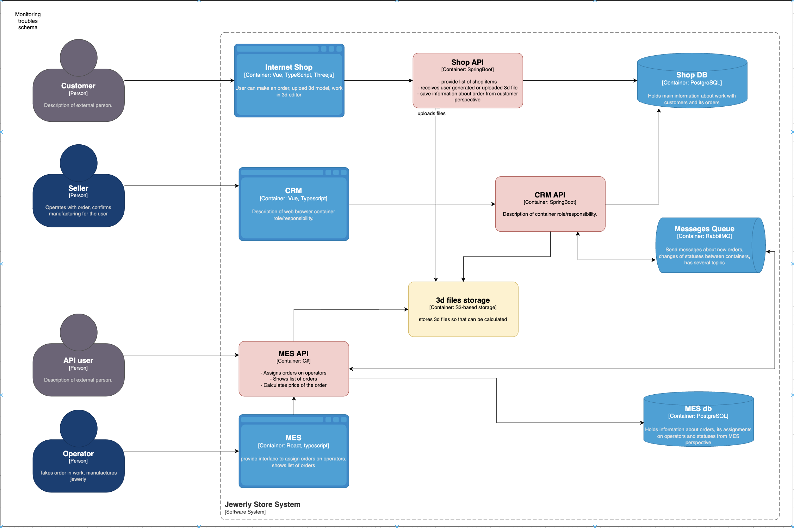
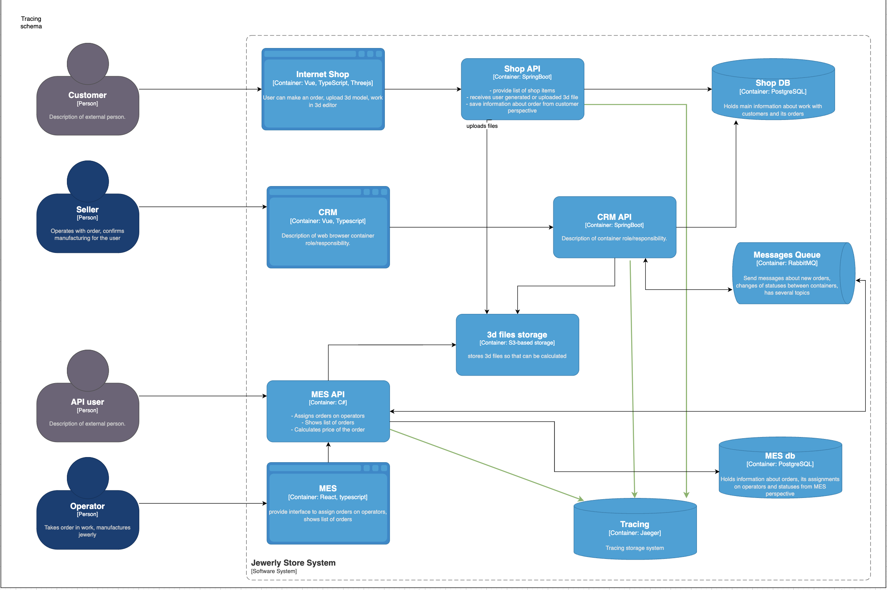
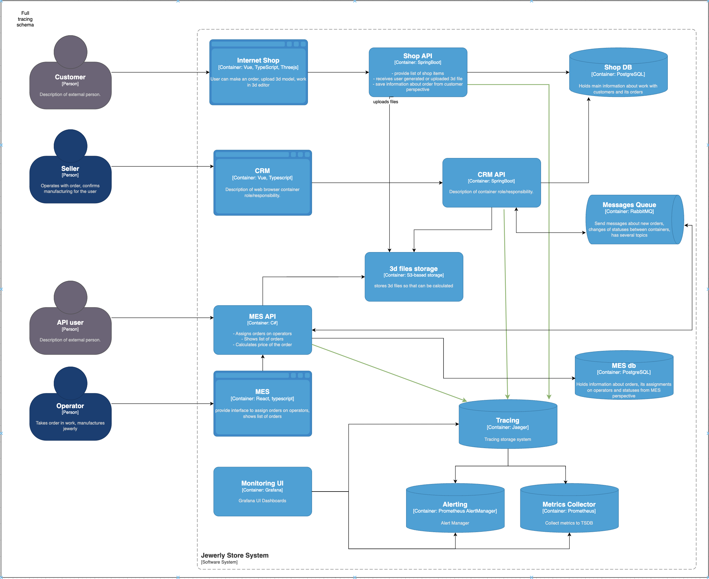

# Трэйсинг. Архитектурное решение по трейсингу

## Mеста, где заказ может «сломаться» или зависнуть

**Shop Component**
 - Зависание поиска товара в каталоге магазина;
 - Зависание при составлении 3D схемы.

**S3 File Storage**
 - Потеря или ошибочная запись файла 3D схемы проекта пользователя.

**CRM Component**
 - Получение недостоверной информации о статусе заказа.
 
**MES Component**
 - Потеря сообщения о новом заказе;
 - Рассинхронизация между статусом заказа и 3D схемой;
 - Потеря событий изменения статуса заказа;
 - Зависание запросов по статусу заказа.

В тейсинге нужны следующие данные:
1. Факты запросов к списку товаров и ответов на них
2. События работы пользователя над 3D схемой в том числе ответ на операцию сохранения схемы
3. События влияющие на статус заказа и ответы  на запросы статуса заказа

# Мотивация
Внедрение трейсинга позволит, в частности, диагностировать причины превышения указанных ниже показателей насыщенности 
по метрикам, а также диагностировать инциденты с которыми сталкивается пользователь - нарушение сроков исполнения заказов, 
длительное время предоставления запрошенной информации, получение противоречивых данных.

- Number of dead-letter-exchange letters in RabbitMQ
- Number of message in flight in RabbitMQ
- Response time (latency) for MES API
- Response time (latency) for CRM API

# Предлагаемое решение
Встроить в code компонентов Shop API, CRM API, MES API sdk OTel для передачи контекста по выполнению запросов:
- запросов к списку товаров
- событий по работе с 3D схемой
- событий жизненного цикла заказа

Развернуть инструмент `Jaeger` для визуализации и анализа трейсов

## Автоматический мониторинг процесса прохождения заказа, полученные из данных трейсинга, и алертинг
 - Jaeger (с поддержкой метрик Prometheus).
 - Prometheus (для сбора метрик из Jaeger).
 - Alertmanager (обработка и отправка алертов).
 - Grafana (дашборды).

Метрики:
- количество заказов в кажом статусе;
- время нахождения конкретного заказа в каждом статусе.

Алерты:
- превышение допустимого времени нахождения заказа в определенном статусе;

Визуализация:
- скорость трэйсов на временной диаграме; 
- средняя скорость обработки заказа (диапазон скоростей).

# Компромиссы
Если доработка легаси системы  Shop API с целью встраивания трейсинга окажется слишком сложной, можно ограничиться 
мониторингом, так как запросы к списку товаров и события по работе с 3D не требуют сложного распределенного 
взаимодействия сервисов.

# Аспекты безопасности
Во всех приложениях есть аутентификация и авторизация.

Для передачи данных трейсинга в Jaeger и доступа пользователей к данным Jaeger должны быть использованы те же средства 
авторизации и сделаны дополнительные настройки ролевой модели.
