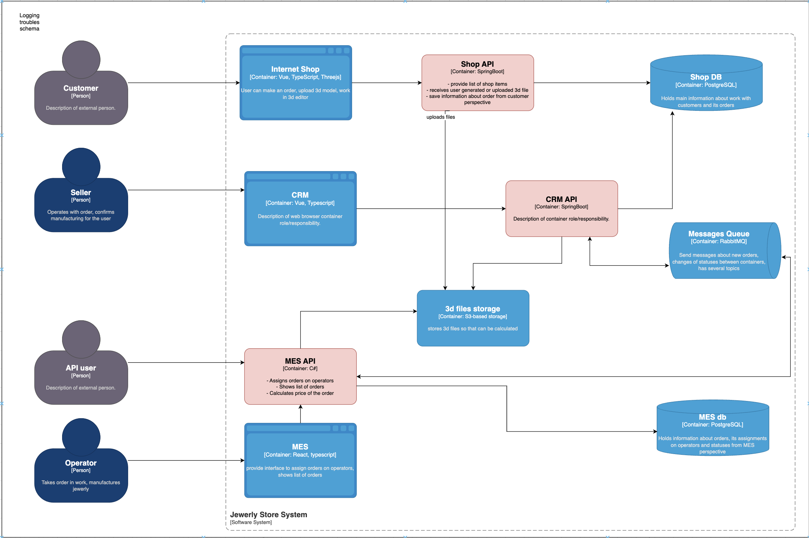
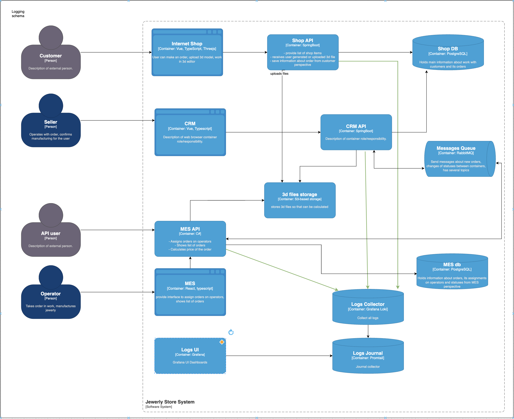

# Логирование. Архитектурное решение по логированию

На схеме отмечено, из каких систем требуется сбор логов

1. Shop API - Создание заказа (номер заказа), сохранение 3D схемы (номер заказа, идентификатор и параметры схемы);
2. CRM API  - Изменение статуса заказа (номер заказа, новый статус, детали статуса заказа);
3. MES API  - Расчет стоимости (номер заказа, детали расчета), статус о выполнении работы (номер заказа, детали результата работы).

Кроме этого везде где в логике программы выявляются ошибочные ситуации, например, переполнение памяти, ошибка обращения 
к БД и т. п необходимы записи в лог уровня ERROR если программа продолжает работу и FATAL если следует аварийная остановка.

На первое время работы системы после внедрения мониторинга и логирования есть смысл оставить лог-сообщения с уровнем 
`DEBUG` (по условию нет информации о теством окружении, где можно проверить работоспособность системы после изменений). 
С помощью этого можно достаточно детально просматривать работу системы и отлавливать программные дефекты. 

Далее в этом не будет необходимости, так как на продакшн-окружении должны быть только необходимые лог-сообщения уровня  
`INFO`, оставляя возможность для вывода `ERROR`, `FATAL` и некоторых `WARN` сообщений.  

# Мотивация
Логирование необходимо для упреждающего  выявление нарушений в работе системы и сокращения сроков диагностики системы. 
Все лог-сообщения доступны для анализа, не требуя дополнительного вмешательства в код. А при должной настройке лог-сообщений
воспроизведение программных дефектов станет гораздно проще и реальнее.

Метрики, которые улучшатся:
- сократится количество инцидентов, обнаруженных пользователем;
- сократится время устранения программного дефекта;
- сократится количество заказов с нарушением сроков.

Поскольку на текущем этапе проявляются трудно диагностируемые  проблемы со своевременным исполнением заказов логирование 
и трейсинг в первую очередь небходимо внедрить в `Shop API` и `MES API`.

# Предлагаемое решение

На мой взгляд для такой небольшой системы нет смысла использовать решения вроде `Elasticsearch` - это оверхед. Достаточно
будет `loki-based` системы. Таким образом, у нас получится настроенная система наблюдения, доступ к которой осуществлсяется
через `Grafana`. 

Для этого необходимо проделать следующие шаги:

1. Настроить систему сбора логов: `loki` и `promtail`.
2. Подключить `loki`-плагин для `docker` или `kubernetes`, который позволяет со всех подов собирать метрики без изменения кода;
3. Проверить работоспособность и создать новый источник в `Grafana` для отображения логов;
4. Анализ выводимой информации в `Grafana`.

### Схема сбора логов

## Безопасность
У Grafana есть своя система авторизации, в целом, достаточно будет создать admin-пользователя именно там. В данной компании
присутствуют аналитики, но они больше заняты анализом продукта, нежели системными вопросами, поэтому нет смысла предоставлять
им доступ к мониторингу. Дополнительно можно закрыть доступ к Grafana для внешних пользователей.

## Политика хранения логов
Предлагаю следующие индексы для хранения логов:
  1. Логи из Shop API - Создание заказа (номер заказа), сохранение 3D схемы (номер заказа, идентификатор и параметры схемы);
  2. Логи из CRM API  - Изменение статуса заказа (номер заказа, новый статус, детали статуса заказа);
  3. Логи из MES API  - Расчет стоимости (номер заказа, детали расчета), Статус о выполнении работы (номер заказа, детали результата работы);

Настройка `ILM`:
 - срок хранения лог-сообщений в индексе можно установить не более 1 года;
 - архивировать лог-сообщения каждый месяц или 3 месяца;
 - rollover по условию max_docs , значение подобрать эмпирическим путем.

# Мероприятия для превращения системы сбора логов в систему анализа логов
Систему алертинга можно настроить для:
 - DDoS атаки, если от одного пользователя поступает количество заказов более 2ух за 1 час;
 - потеря заказа, если пользователь сделал заказ, а через какое-то время система возвращает 404;
 - расчет стоимости заказа выполнялся дольше заданного интервала;
 - зависание системы, если заказ обрабатывается больше одного 1-2 часов;
 - наличие ошибок с уровнем `ERROR`.
