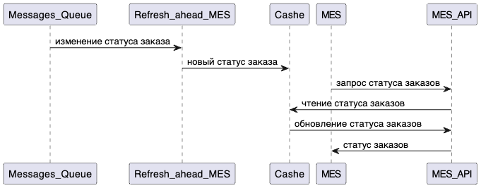

# Кэширование. Архитектурное решение по кешированию.

Внедрение системы кэширования в системе вызваны следующими проблемами:
1. Операторы и пользователи жалуются на низкую скорость работы с `MES` компонентом;
2. Пользователей и клиентов внешних систем не устраивает скорость выполнения заказа;

Отчасти данная проблема вызвана потерей информации вследствие логических ошибок в коде и "застреванием" заказов в очередях. 
Эти причины будут локализованы и исправлены при реализации планов, подготовленных в предыдущих разделах.

Если при этом скорость прохождения заказа не достигнет приемлемых значений, прежде чем масштабировать сервисы ответственные 
за обаботку заказа, необходимо найти в логике обработки заказа места, где происходит многократное  обращение к одним и
тем же данным, и закешировать эти данные.

# Предлагаемое решение

## Клиентский кэш
С момента взятия в обработку заказа оператором все данные по заказу помещаются в клиентский кэш с `max-age` равным среднему 
времени непрерывной работы оператора над заказом (определяется эмпирически).

Некотрые параметры заказа могут меняться со стороны системы обновляются с заголовком `no-cashe`.

## Серверный кэш
Серверный кэш необходимо применить к списку заказов для того чтобы распределение заказов в `MES API` выполнялось быстро.

Такой кэш будет работать в соответсвии с паттерном `Refresh-ahead`, для того чтобы `MES API` получало всегда актуальный список заказов.

Паттерны `Cache-Aside` и `Write-Through` будут не так эффективны - они предназначены для случая интенсивного чтения при 
редких изменениях, а в нашем случае изменения со стороны `CRM` могут иметь интенсивность сравнимую с чтением со стороны 
`MES`, кроме того оперативность чтения данных по отдельно взятому заказу уже обеспечивается клиентским кэшем.

## Диаграммы последовательности

### Операция чтения списка заказов
Сущности:
- Заказ
- Детали заказа (наименование свойства, значение свойства)
- Статус Заказа
- Событие Статуса (дата)

@startuml
MES  -> MES_API : запрос списка заказов
MES_API -> Cashe : чтение списка заказов
MES_API <- Cashe : обновление списка заказов
MES  <- MES_API :  список заказов
Refresh_ahead_MES -> MES_DB : запрос изменений списка заказов
Refresh_ahead_MES <- MES_DB : обновление списка заказов
Refresh_ahead_MES -> Cashe : обновление списка заказов
@enduml

### Запись об изменении статуса заказа
@startuml
Messages_Queue -> Refresh_ahead_MES : изменение статуса заказа
Refresh_ahead_MES -> Cashe : новый статус заказа
MES  -> MES_API : запрос статуса заказов
MES_API -> Cashe : чтение статуса заказов
MES_API <- Cashe : обновление статуса заказов
MES  <- MES_API :  статус заказов
@enduml

## Стратегии инвалидации

| Временная | По ключу | остальные |
|:-----------|:-----:|------------:|
|для клиентского кэша     | для серверного кэша  |не решают нужных задач |
|кэш нужен на время работы оператора     | кэш обновляется по событиям в контексте конкретного заказа  |другие критерии обновления |
